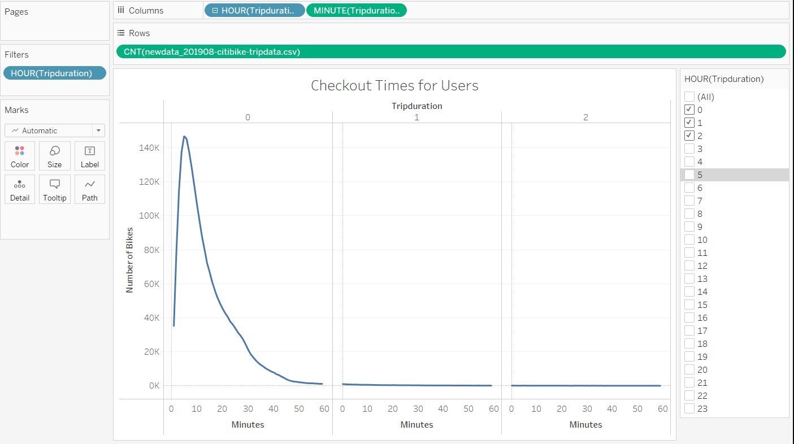
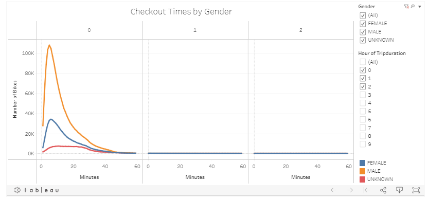
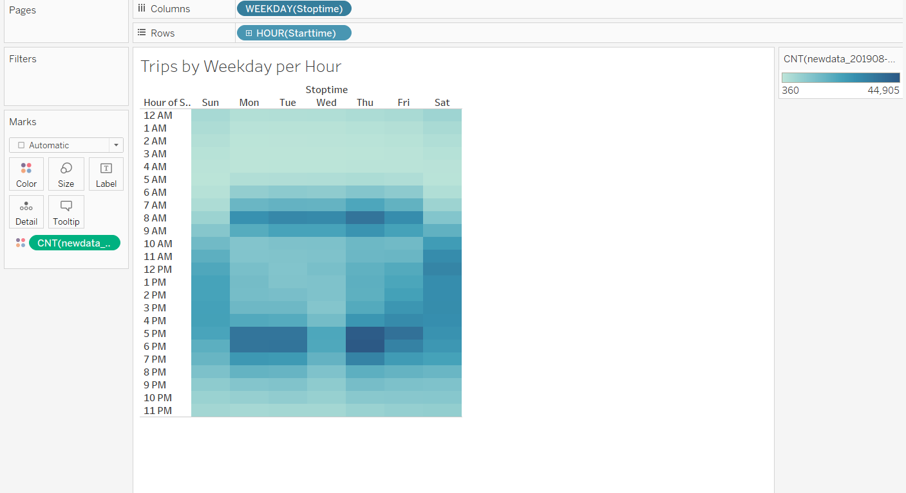
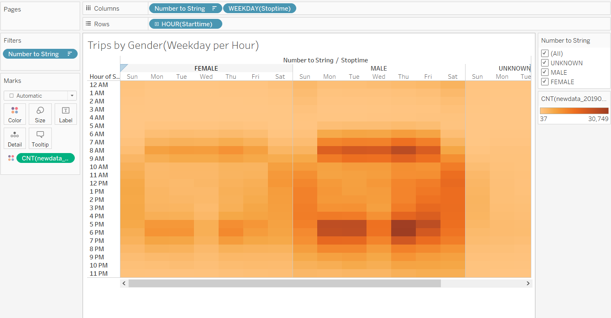
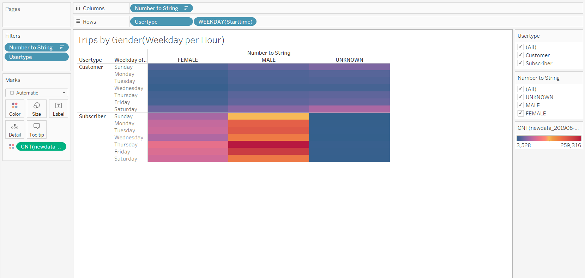

# bikesharing

## Resources
	-Pandas
	-citibike-tripdata.csv
	-Tableau Public

# Tableau Dashboard website link
[link to Tableau Story](https://public.tableau.com/profile/lisette.worster#!/vizhome/Bikesharing_16205111904840/Story)

# Results
## Checkout Times for Users
	-peak usage for nyc citibikes occurs at 5 minutes.
	-146,752 bikes were checked out 
	

	

	

## User Trips by Gender by Weekday

# Summary
	There is a high-level summary of the results and two additional visualizations are suggested for future analysis
